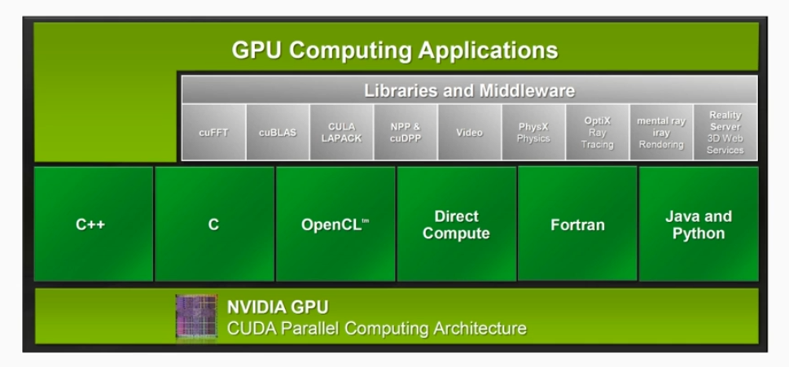
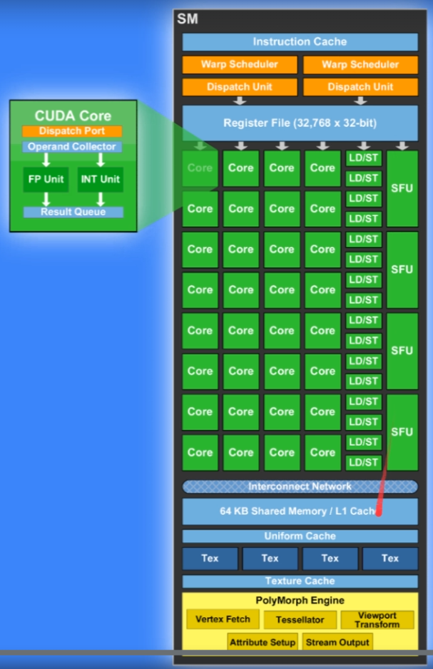
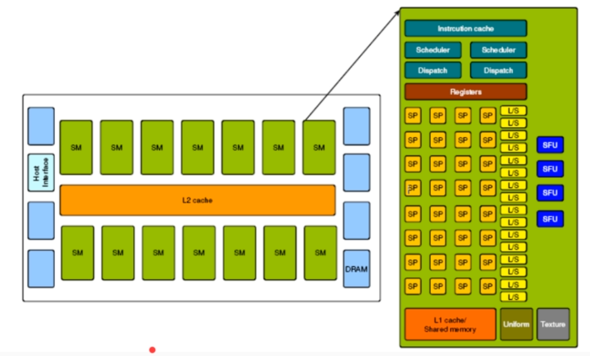
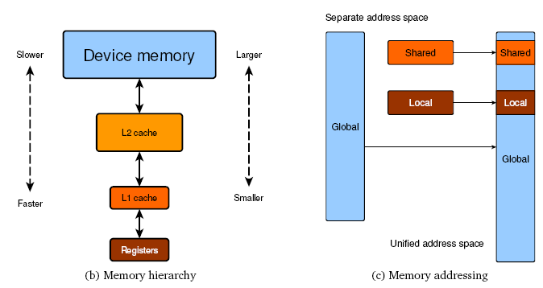
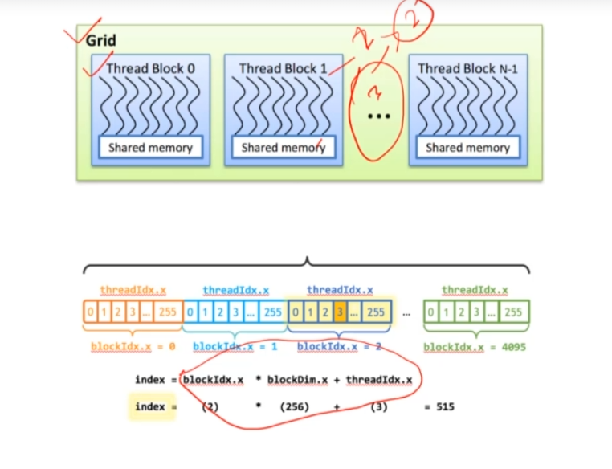
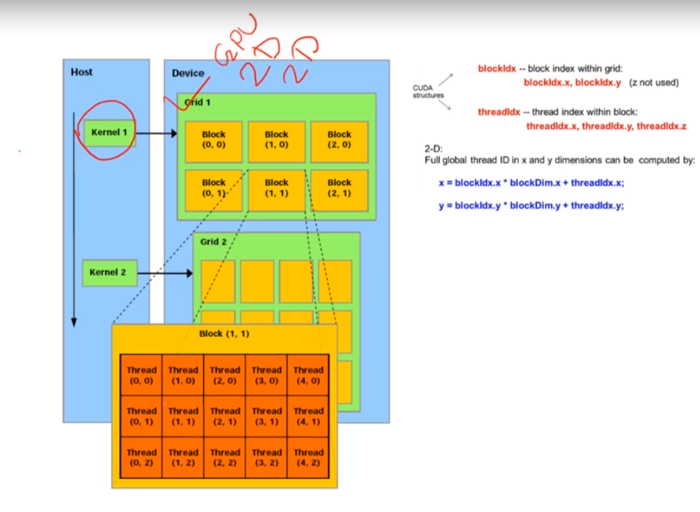

# GPU programming with CUDA
Reference: https://docs.nvidia.com/cuda/cuda-c-programming-guide/index.html#introduction

## GPU
 GPU is built around an array of **Streaming Multiprocessors(SMs)**. A multithreaded program is partitioned into blocks of threads that execute independently from each other, so that a GPU with more multiprocessors will automatically execute the program in less time than a GPU with fewer multiprocessors.

Number of SMs are depends on devices


Memory Model Diagram


## Programming Model
### Kernels
CUDA funtions. Kernel calls syntax:
```c++
// Kernel - copy
__global__ void func(float* a, float* b){
    int i = threadIdx.x;
    a[i] = b[i];
}

// host
int main(){
    int nBlock = 1;
    int nThreadPerBlock = 16
    func<<nBlock, nThreadPerBlock>>();
}

```

Dimension is defined by:
* block per grid
* thread per block  

You can use `int` or `dim3`

### Thread Hierarchy
Grid of Thread Blocks
- Grid (3 col * 2 row)
    - Block1 (0, 0)  -> (4 col * 3 row)
        - Thread 1 (0, 0)
        - Thread 2 (1, 0)
        - ...
        - ...
        -Thread 12 (3, 2)
    - Block2 (1, 0)
    - Block3 (2, 0)
    - Block4 (0, 1)
    - Block5 (1, 1)
    - Block6 (2, 1)

```c++
__global__ void funcAdd2D(float[][] a, float[][] b, float[][] c)
{
    int i = threadIdx.x;
    int j = threadIdx.y;
    c[i][j] = a[i][j] + b[i][j];
}

// sove 2d matrix use 1d vec r * c
__global__ void funcAdd1d(float* a, float* b, float* c)
{
    int r = threadIdx.x;
    int c = threadIdx.y;
    c[r][c] = a[r][c] + b[r][c];
}

int main()
{
    // 1. Kernel invocation with one block of N * N * 1 threads
    int numBlocks = 1;
    dim3 threadsPerBlock(N, N);
    funcAdd2d<<<numBlocks, threadsPerBlock>>>(A, B, C);

    // 2. use 1d vector to represent 2d matrix
    int nBlocks = 1;
    dim3 nThreads(r, c);
    funcAdd1d<<nBlocks, nThreads>>(a, b, c);

    // 3. set blocks number by calculation, e.g. img 512 * 512
// Kernel definition
const int N = 512;

__global__ void funcAdd1d(float* A, float* b, float* c)
{
    int x = blockIdx.x * blockDim.x + threadIdx.x;
    int y = blockIdx.y * blockDim.y + threadIdx.y;


    if (x < N && y < N)
        idx = x + y * N;
        C[idx] = A[idx] + B[idx];
}


    dim3 dimThread(16, 16);
    dim3 dimBlocks(N / threadsPerBlock.x, N / threadsPerBlock.y);
    MatAdd<<<dimBlocks, dimThread>>>(a, b, c);
}

```

### Fundmental Steps
1. Allocate **host** memory
    * initalzie
2. Allocate **device** memory
    * copy data from host to device
3. Call Kernels
4. Copy data back to host
5. Release device and host memory

### Check GPU hardware info before programming to use the best performance
```c++
int dev = 0;
    cudaDeviceProp devProp;
    CHECK(cudaGetDeviceProperties(&devProp, dev));
    std::cout << "GPU device Name" << dev << ": " << devProp.name << std::endl;
    std::cout << "SM Number：" << devProp.multiProcessorCount << std::endl;
    std::cout << "Share Memory Per Block：" << devProp.sharedMemPerBlock / 1024.0 << " KB" << std::endl;
    std::cout << "Max Thread per Block" << devProp.maxThreadsPerBlock << std::endl;
    std::cout << "Max Thead per EM" << devProp.maxThreadsPerMultiProcessor << std::endl;

```

## Unified Memory
```c++
cudaError_t cudaMallocManaged(void **devPtr, size_t size, unsigned int flag=0);

// Use cudaDeviceSynchronize() to access correct result in host.
cudaDeviceSynchronize();
```


## Heterogeneous Computing
* Host - CPU
* Device - GPU

Basic Workflow:  
1. Copy Data from CPU memory to GPU
2. Load and Execute GPU program  
    * Caching data on chip for performance
4. Copy Result from GPU memory to CPU memory

## GPU software Layers
Softare Application Layer - cuda interface  



Device Processing Unit - sm  
Streaming Multi-Processor


Processing Logics:
`Thread` executed by `Core`  
`Thread Block` Executed by `Steaming Multirocessor`  
`Kernel Grid` Executed by Complete `GPU Unit`  



A schematic diagram of the Tesla’s unified GPU architecture is shown in the figure above. It illustrates the framework of a Tesla C2050 device. The device has a total of 448 streaming-processor (SP) cores organized as a group of 32 stream processors (also called CUDA cores), in 14 streaming multiprocessors (SM). Each core here executes a sequential thread in a so-called SIMT (Single Instruction, Multiple Thread) fashion and all the threads in a same wrap execute the same instruction at the same time, where a wrap is a group of 32 threads. Tesla supports up to 32 active warps on each SM. If one warp stalls at any conditional operation, then it selects another ready warp so that the cores can remain active.  

  
Similar to other GPUs, the Tesla device has a hierarchy of on-board memory, such as a small and fast programmable L1 cache/shared memory (16 – 48 KBs), a fully coherent L2 cache memory (512–768 KBs) and a relatively large on-board DRAM or device main memory (3–6 GBs). The L1 cache is attached to each multiprocessor and shared among the comprising cores, where the unified L2 cache is shared across the device. The main task of L2 memory is to minimize the effect of the long latency of device DRAM. There are also some register files (128 KBs), texture and constant caches within each SM. At the software level, all the memory levels are unified into a single continuous address space.

There exist a number of application programming interfaces (API) that can enable programmers to access the device memory and develop GPU-based applications.


## Indexing in CUDA

### Thread and Block in 1D
 * Grid
    * Block
        * Thread  

Index = blockIdx.x * blockDim.x + threadIdx.x 
 

### Thread and Block in 2D

x = blockIdx.x * blockDim.x + threadIdx.x  
y = blockIdx.y * blockDim.y + threadIdx.y 

 

### Grid, Block, Threads and Mem
```
blockId = blockIdx.x + blockIdx.y * GridDim.x
threadId = blockId * (blockDim.x * blockDim.y) + (threadIdx.y*blockDim.x) + threadIdx.x

```

#### N thread and N block
M threads per Block
```C++
int index = threadIdx.x + blockIdx.x * M
          = threadIdx.x + blockIdx.x * blockDim.x

___global___ void add(int *a, int *b, int *c){
    int index = threadIdx.x + blockIdx.x * blockDim.x;
    c[index] = a[index] + b[index];
}

#define N (2048 * 2048)
#define THREADS_PER_BLOCK 512

int main(){
    int *a, *b, *c;
    int *dA, *dB, *dC;
    int isze = N * sizeof(int);

    cudaMalloc((void**)&dA, size);
    cudaMalloc((void**)&dA, size);
    cudaMalloc((void**)&dA, size);

    a = (int*) malloc(size);
    random_ints(a, N);
    b = (int*) malloc(size);
    random_ints(b, N);
    c = (int*) malloc(size);

    cudaMemcpy(dA, a, size, cudaMemcpyHostToDevice);
    cudaMemcpy(dB, b, size, cudaMemcpyHostToDevice);

    add<<<N/THREADS_PER_BLOCK, THREADS_PER_BLOCK>>>(dA, dB, dC);
    
    cudaMemcpy(c, dC, size, cudaMemcpyDeviceToHost);

    free(a); free(b); free(c);
    cudaFree(dA); cudaFree(dB); cudaFree(dC);

    return 0;
}


```


