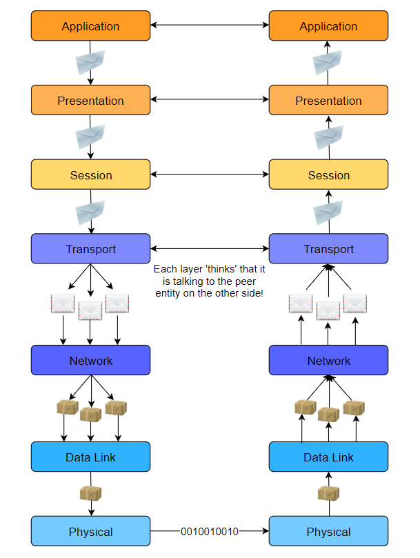

# Layered Architectures & Network Model
Layered architectures give us modularity by allowing us to discuss specific, well-defined parts of larger systems. This makes **changing implementation-level details** and **identifying bugs easier**.

* Vertical Layers
    * `Abstraction` Each layer provides some services to the layer above it. Furthermore, the layer above is not concerned with the details of how the layer below performs its services.
* Horizontal Layers
    * Layers communicate with their parallesls. e.g. application 1 to application 2, etc.

## Common Models

### Open Systems Interconnection (OSI)
7 abstract layers
| OSI Model  |
|------------|
|Application |
|Presentation|
|Session     |
|Transport   |
|Network     |
|Data Link   |
|Physical    |

* **Application Layer**
    * These applications or protocols are almost **always implemented in software.**
    * **End-users interact** with the application layer.
    * The application layer is where most **end-user applications** such as web browsing and email live.
    * The application layer is where an outgoing message starts its journey so it **provides data for the layer below**.

* **Presentation Layer**
    * **Presents data** in a way that can be easily understood and displayed by the application layer.

        * **Encoding** is an example of such presentation. The underlying layers might use a different character encoding compared to the one used by the application layer. The presentation layer is responsible for the translation.
    * **Encryption** (changing the data so that it is only readable by the parties it was intended for) is also usually done at this layer.

    * **Abstracts**: the presentation layer assumes that a user session is being maintained by the lower layers and transforms content presentation to suit the application.

    * **End-to-end Compression**: The presentation layer might also implement end to end compression to reduce the traffic in the network.

* **Session Layer**
    * The session layer’s responsibility is to take the services of the transport layer and build a service on top of it that **manages user sessions**.

        * As we will see shortly, the transport layer is responsible for transporting session layer messages across the network to the destination. The session layer must manage the mapping of messages delivered by the transport layer to the sessions.
    * A session is an exchange of information between local applications and remote services on other end systems.

        * For example, one session spans a customer’s interaction with an e-commerce site whereby they search, browse and select products, then make the payment and logout.
    * **Abstracts**: the session layer assumes that connections establishment and packet transportation is handled by the layers below it.

* **Transport Layer**
    * The **transport layer** also has protocols implemented largely in software.
    * Since the application, presentation and session layers may be handing off large chunks of data, the transport layer segments it into smaller chunks.
        * These chunks are called **datagrams or segments** depending on the protocol used.
    * Furthermore, sometimes some **additional information** is required to transmit the segment/datagram reliably. The transport layer **adds this information to the segment/datagram**.
        * An example of this would be the **checksum**, which helps ensure that the message is correctly delivered to the destination, i.e. that it’s not corrupted and changed to something else on the way.
        * When additional information is added to the **start** of a segment/datagram, it’s called a **header**.
        * When additional information is appended to the **end** it’s called a **trailer**.

* **Network Layer**
    * Network layer messages are termed as **packets**.
    * They facilitate the **transportation of packets** from one end system to another and help to determine the best routes that messages should take from one end system to another.
    * **Routing protocols** are applications that run on the network layer and exchange messages with each other to develop information that helps them route transport layer messages.
    * **Load Balancing** There are many links (copper wire, optical fiber, wireless) in a given network and one objective of the network layer is to keep them all roughly equally utilized. Otherwise, if some links are under-utilized, there will be concerns about the economic sense of deploying and managing them.

* **Data Link Layer**
    * Allows directly connected hosts to communicate. Sometimes these hosts are the only two things on a physical medium. In that case, the challenges that this layer addresses include **flow control** and **error detection/correction**.
    * **Encapsulates packets** for transmission across a single link.
    * **Resolves transmission conflicts** i.e., when two end systems send a message at the same time across one singular link.
    * **Handles addressing** If the data link is a broadcast medium, addressing is another data link layer problem,
    * **Multiplexing & Demultiplexing**:
        * Multiple data links can be multiplexed into something that appears like one, to integrate their bandwidths.
        * Likewise, sometimes we disaggregate a single data link into virtual data links which appear like separate network interfaces.

* **Physical Layer**
    * Consists largely of hardware.
    * Provides a solid electrical and mechanical medium to transmit the data.
    * Transmits bits. Not logical packets, datagrams, or segments.
    * Also has to deal with mechanical specifications about the makeup of the cables and the design of the connectors.

### Transmission Control Protocol/Internet Protocol (TCP/IP)

5 layers
| TCP/IP     |
|------------|
|Application |
|Transport   |
|Network     |
|Data Link   |
|Physical    |

* OSI is a theoretical(Conceptual) model. Not Practically used for communication.

* TCP/IP, on the other hand, wasn’t really a model. People just implemented it and got it to work. Then, people **reverse-engineered a reference model** out of it for theoretical and pedagogical purposes. So, something that “sounds like” a great idea might not be the eventual winner. It’s de facto vs de jure standards.

