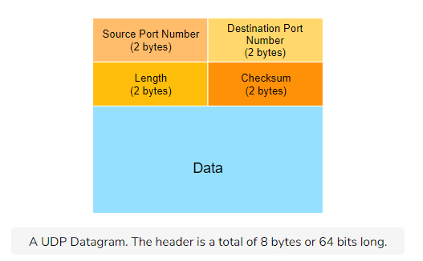
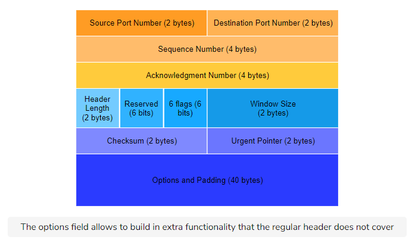
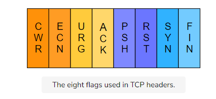
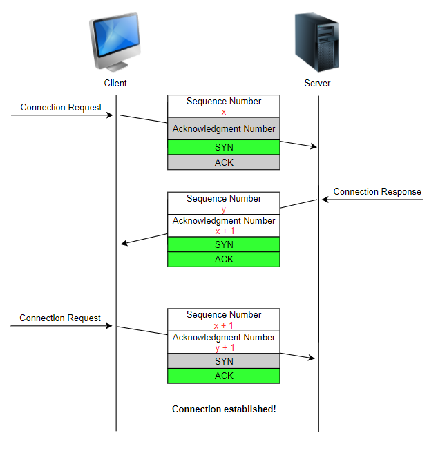
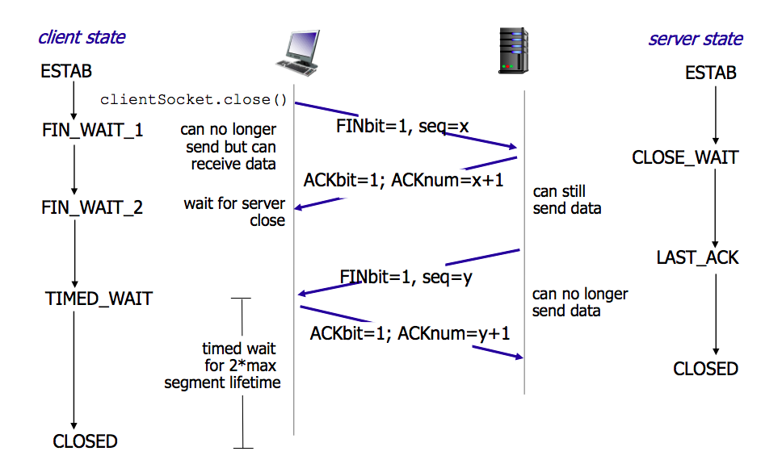
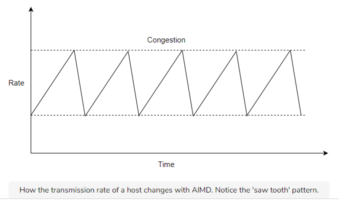
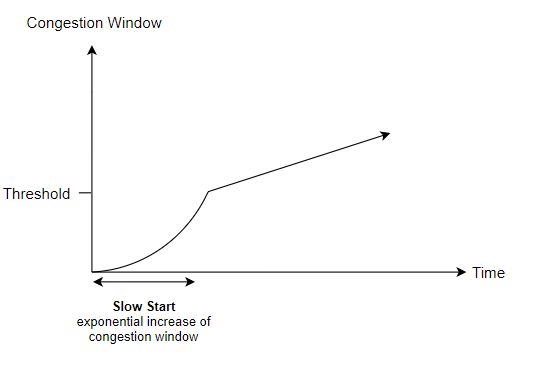
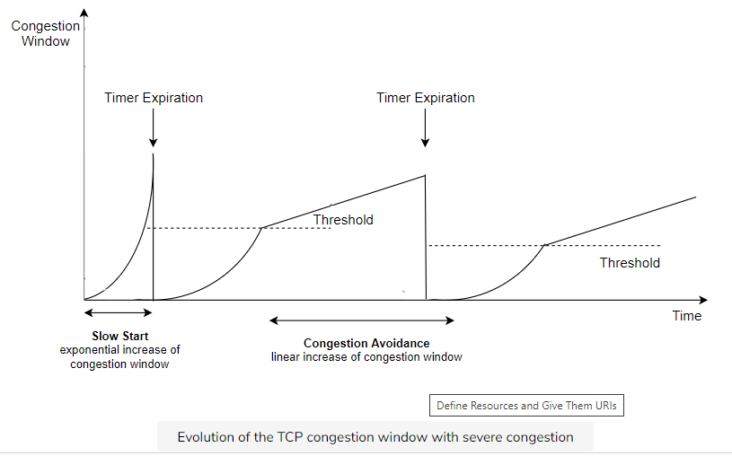
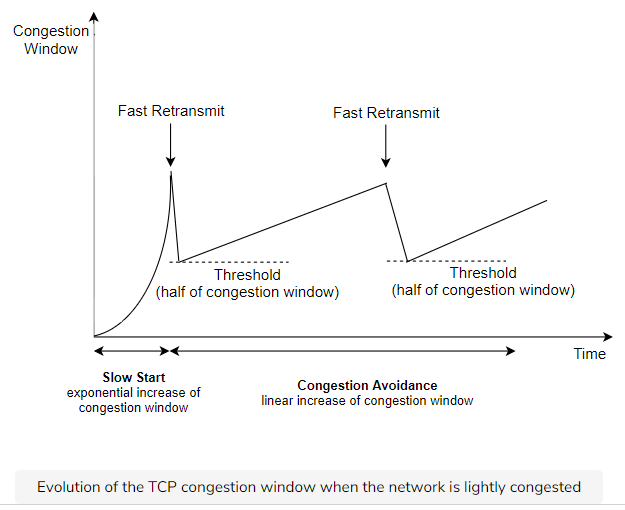

# Network Model Layer

## Transport Layer

### Reliable Data Transfer
**Issues**:
1. data corrupted
2. segment lost
3. reordered or duplicated

### Data Corruption
* Checksums

### Segment Lost
* Retransmission Timers
* **ACK** to prevent loss

However, **ACK** lost will cause packet duplication. 
- Client send Seg 1
- Client don't receive ACK1
- Client thought Seg 1 not received by Server
- Client send Seg 1 again.

### Segment duplication
1. SEQ - prevent duplication
2. Sliding Window - window move only when all packets received.

### Dection and Retransmission of lost packets
1. `Go-Back-N`
    - The simplest sliding window protocol uses go-back-n recovery.
        - It only accepts the segments that arrive in-sequence.
        - It discards any out-of-sequence segment that it receives.
        - When it receives a data segment, it always returns an acknowledgment containing the sequence number of the last in-sequence segment that it has received.
    1. Go-Back-N `Receiver`
        1. Cumulative Acknowledgements
            - Client sends 1
            - Client sends 2
            - Client sends 3
            - ACK1 and ACK2 lost
            - Client receives ACK 3!
                - It is **OK**! ACK received mean 1 and 2 also received
    2. Go-Back-N `Sender`
        - A go-back-n sender uses a sending buffer that can store an entire sliding window of segments.
        - The segments are sent with a sending sliding window that we looked at in the last lesson.
        - The sender must wait for an acknowledgment once its sending buffer is full.
        - When a go-back-n sender receives an acknowledgment, it removes all the acknowledged segments from the sending buffer.
            - Client Send 0, 1, 2
            - 1 lost
            - Server will consider both 1 and 2 lost
            - After retransmission timer expires, client resend 1 and 2

`
Advantage of `Go-Back-N`
* The go-back-n receiver does not accept out-of-sequence segments.
* The go-back-n sender retransmits all unacknowledged segments once it has detected a loss.

2. `Selective Repeat`
* Uses a sliding window protocol just like go-back-n.
* The window size should be less than or equal to half the sequence numbers available. This avoids packets being identified incorrectly. Here’s an example: suppose the window size is greater than half the buffer size.
    * Segment ‘1’ is lost, hence the receiver expects a segment with sequence number 1 to be retransmitted.
    * Meanwhile, the window wraps around back to sequence number ‘1.’
    * The sender sends a new packet with sequence number 1 and the receiver perceives it to be the original one that it was expecting.
* Senders retransmit unacknowledged packets after a timeout or if a NAK (negative acknowledgment/not acknowledged) is received.

* The receiver acknowledges all correct packets.

* The receiver stores correct packets until they can be delivered in order to the upper application layer.

### **UDP** User Datagram Protocol

#### Format:
* Header
    * Source Port - 2 bytes
    * Destination Port - 2 bytes
    * Length - 2 bytes
    * Checksum - 2 bytes

* Data
    * 2^16 = 65536 bytes

#### Checksum Calculation
1. The payload and some of the headers (including some IP headers) are all divided into 16-bit words.
2. These words are then added together, wrapping any overflow around.
3. Lastly, the one’s complement of the resultant sum is taken and appended to the message as the checksum.

#### Why UDP
1. UDP can be **faster**. Some applications cannot tolerate the load of the retransmission mechanism of TCP, the other transport layer protocol.

2. **Reliability can be built on top of UDP**. TCP ensures that every message is sent by resending it if necessary. However, this reliability can be built in the application itself.

3. UDP gives **finer control** over what message is sent and when it is sent. This can allow the application developer to decide what messages are important and which do not need concrete reliability.

4. Going on points 3 and 4, **UDP allows custom protocols to be built on top of it**.
    * In fact, Google’s transport layer protocol, **Quick UDP Internet Connections (QUIC)**, pronounced quick, is an experimental transport layer network protocol built on top of UDP and designed by Google. The overall goal is to reduce latency compared to that of TCP. It’s used by most connections from the Chrome web browser to Google’s servers!
5. With the significantly smaller header gives UDP an edge over TCP in terms of reduced transmission overhead and quicker transmission times.

**DNS** uses UDP. If failed message delivery, DNS either:
1. Resends the message.
2. Sends the message to some other server.
3. Gives a failure message.

#### Network Management
Network management and network monitoring is done using a protocol called **[Simple Network Management Protocol](https://en.wikipedia.org/wiki/Simple_Network_Management_Protocol)** and it runs on UDP as well.

### **TCP** Transmission Control Protocol

#### Key Responsibilities:
1. Send Data
2. Segment Data
3. End to end flow control
4. Identify and retransmit messages that do not get delivered
5. Identify when messages are received out of order and reassemble them

#### Applications Uses TCP
* FTP
* SSH
* Email - SMTP, IMAP, POP
* Web Browsing - http, https

#### Format

* `Source Port` and `Destination Port`
    * 2 bytes each

* `Sequence Number`
    * 4 bytes
    * Every byte of the TCP segment’s data is labeled with a number called a sequence number. The sequence number field in the header has the sequence number of the first byte of data in the segment.

* `Acknowledgement Number`
    * 4 bytes
    * The acknowledgment number is a 4-byte field that represents the sequence number of the next expected segment that the sender will send or the receiver will receive

    * **Example**  
    A segment’s sequence number was 4284942849 and its data field had 5959 bytes of data, the sequence number of the next expected segment or the acknowledgment number would be 4290842908. This helps TCP to identify if a segment was missing or out of order.

* Header Length - 4 bits
* Reserved - 4 bits
* 8 flags - 8 bits
    * 
    * ACK
        * flag is set to 11 in a segment to acknowledge a segment that was received previously
    * RST
        * The reset flag immediately terminates a connection. This is sent due to the result of some confusion, such as if the host doesn’t recognize the connection, if the host has crashed, or if the host refuses an attempt to open a connection.
    * SYN
        * The synchronization flag initiates a connection establishment with a new host.
    * FIN
        * This flag is used to terminate or finish a connection with a host.
    * PSH
        * push - merge small TCP segment and send only once
    * URG
        * The Urgent flag marks some data within a message as urgent. Upon receipt of an urgent segment, the receiving host forwards the urgent data to the application with an indication that the data is marked as urgent by the sender. The rest of the data in the segment is processed normally.
#### **Connection**

##### **3 way Handshake connection**

* First:  Client send (SYN bit = 1, seq = x)
* Second: Server send (SYN bit = 1, ACK bit = 1, seq = y, ack = x + 1)
* Third:  Client send (ACK bit = 1, seq = x + 1, ack = y + 1)

##### **4 way Termination**

* First:  Client send (FIN bit = 1, seq = x)
* Second: Server send (ACK bit = 1, ack = x + 1)  
...(Wait for all communication done)... 
* Third:  Server send (FIN bit = 1, seq = y)
* Fourth: Client send (ACK bit = 1, ack = y + 1)

#### **Data Transmission**
Strategies:
1. Send a TCP segment as soon as the application has requested the transmission of some data.
    * **Advantage**: This allows TCP to provide a low delay service.
    * **Disadvantage**: If the application is writing data one byte at a time, TCP would place each byte in a segment containing 20 bytes of the TCP header. This is a huge overhead that is not acceptable in wide area networks.
2. Transmit a new TCP segment once the application has produced MSS bytes of data. Recall MSS from this lesson on TCP Headers.
    * **Advantage**: Reduced overhead
    * **Disadvantage**: Potentially at the cost of a very high delay, which may be unacceptable for interactive applications.

#### TCP Window Scaling
`Round Trip Time` vs. `Bandwidth` vs. `Throughput`
* Round Trip Time is the amount of time it takes to send a packet and receive its acknowledgment.
* Bandwidth is the rate at which the network can transport the bits.
* Throughput is the amount of data that is actually transferred from one end-system to another.

#### TCP Congestion Control

##### AIMD - Additive Increase Multiplicative Decrease
The Additive Increase Multiplicative Decrease algorithm decreases the transmission rate of a host when congestion has been detected in the network. Congestion is detected when acknowledgments for packets do not arrive before the transmission timer times out. Furthermore, it increases their transmission rate when the network is not congested. Hence, the rate allocated to each host fluctuates with time, depending on the feedback received from the network.

The Additive Increase part of the TCP congestion control increments the congestion window by MSS bytes every round-trip time. In the TCP literature, this phase is often called the congestion avoidance phase. Once congestion is detected, the Multiplicative Decrease part of the TCP congestion control reacts by multiplying the current value of the congestion window with a number greater than 0 and less than 11.

However, since the increase in the window is so slow, the TCP connection may have to wait for many round-trip times before being able to efficiently use the available bandwidth. To avoid this, the TCP congestion control scheme includes the slow-start algorithm.

##### Slow Start
1. The congestion window is doubled every round-trip time.
2. The slow-start algorithm uses an additional variable in the TCB to maintain the slow-start threshold.
    * The slow-start threshold is an estimation of the last value of the congestion window that did not cause congestion.
    * It is initialized at the sending window and is updated after each congestion event.

* Severe Congestion
    1. The sender performs slow-start until the first segments are lost and the retransmission timer expires.

    1. At this time, TCP retransmits the first segment and the slow start threshold is set to half of the current congestion window. Then the congestion window is reset at one segment.

    1. The lost segments are retransmitted as the sender again performs slow-start until the congestion window reaches the slow start threshold.

    1. It then switches to congestion avoidance and the congestion window increases linearly until segments are lost and the retransmission timer expires.
    
* Mild Congestion
1. The sender begins with a slow-start.
2. If 3 duplicate ACKs arrive, the sender performs a fast retransmit (retransmits without waiting for the retransmission timer to expire).
Have a look at the following slides to see when 3 duplicate acknowledgments could arrive and when a fast retransmit happens.
3. If the fast retransmit is successful, this implies that only one segment has been lost.

    * In this case, TCP performs multiplicative decrease and the congestion window is divided by 22.
    * The slow-start threshold is set to the new value of the congestion window.
4. The sender immediately enters congestion avoidance as this was mild congestion.
