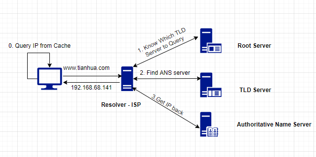

# Browser Fundmentals

## Browser High Level Structure
1. User Interface
2. Browser Engine
3. Rendering Engine
    1. Networking
    2. UI Backend
    3. JavaScript Interpreter
4. Data Storage  

## What happend after you click a URL
`http://www.tianhua.com/fang`

### Key Words

* **URL** - **Uniform Resource Locator**  
An address of resource

* **Protocol**  
`http`, `https`, `ftp`, etc are sets of rules to communicate between network.

* **Domain Name**  
`www.tianhua.com` - part of the URL  
    * Unique Identity to the website
    * Will be mapped/resolved to `IP` address
        * Easy to remember than **IP**
        * `192.168.68.141` -> `www.tianhua.com`

* **DNS**  
DNS resovles domain name to IP address. e.g.   `www.tianhua.com` -> [DNS] -> `192.168.68.141` 

* **ISP** - Internet Service Provider, it is also the `Resolver Server`

* **TLD** - Top Level Domain  
    * .com, .edu, .org, etc

* **Authoritative Name Server** - has all the details of IP address associated with the domain anme.

### 4 Layers to query domain name
There are 4 Layers through Domain Name Query Process:  
1. `Cache`   
    1. `Browser Cache`
    2. `OS Cache`  
    3. `Router Cache`
2. `Resolver Server(ISP)` 
3. `TLD Server`
4. `Authoritative Name Server`


### What Happend
1. Obtain target IP from DNS Server
2. Initiates connection with targeting Server
    * TCP/IP 3-way handshake
3. Communication to get data
    * HTTP exchange
    * Request -> Response
4. Rendering Pages
5. Cloase TCP Connection

_Diagram for IP resolving_  


_Diagram for TCP/IP 3-way Handshake_  


#### Parsing a sample request
```http
GET / HTTP/1.1
Host: google.com
Accept: */*
```

* `GET / HTTP/1.1`: with the start line, the browser asks the server to retrieve the document at the location /, adding that the rest of the request will follow the HTTP/1.1 protocol. It could also have used 1.0 or 2.

* `Host: google.com`: this is the only **HTTP header mandatory in HTTP/1.1**. Since the server might serve multiple domains (google.com, google.co.uk, etc.) the client here mentions that the request was for that specific host.

* `Accept: */*`: an optional header, where the browser is telling the server that it will accept any kind of response back. The server could have a resource that is available in JSON, XML, or HTML formats, so it can pick whichever format it prefers.

#### Parsing a sample response

```http
HTTP/1.1 200 OK
Cache-Control: private, max-age=0
Content-Type: text/html; charset=ISO-8859-1
Server: gws
X-XSS-Protection: 1; mode=block
X-Frame-Options: SAMEORIGIN
Set-Cookie: NID=1234; expires=Fri, 18-Jan-2019 18:25:04 GMT; path=/; domain=.google.com; HttpOnly

<!doctype html><html">
...
...
</html>
```

`200 OK` - Response status

### Reference
* Inside Look at Modern Web Browser
    * [part 1](https://developers.google.com/web/updates/2018/09/inside-browser-part1)
    * [part 2](https://developers.google.com/web/updates/2018/09/inside-browser-part2)
    * [part 3](https://developers.google.com/web/updates/2018/09/inside-browser-part3)
    * [part 4](https://developers.google.com/web/updates/2018/09/inside-browser-part4)
* How Browsers Work: Behind the scenes of modern web browsers
    * [Link](https://www.html5rocks.com/en/tutorials/internals/howbrowserswork/#Gradual_process)