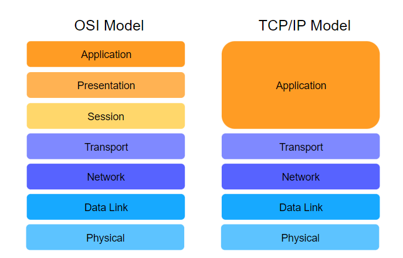

# Computer Network 

There are two main purposes of computer networks: 
1. Communication using computers and 
2. Sharing of resources. 

## Web Basic

### Protocol
Protocol is an analogy that end systems used to communicate with each other effectively on the network.

#### TCP
The Transmission Control Protocol (**TCP**) is one such protocol. It was created to allow end systems to communicate effectively. The distinguishing feature of TCP is that it ensures that data reaches the intended destination and is not corrupted along the way.

#### UDP
The User Datagram Protocol (**UDP**) is also one such key protocol. However, it does not ensure that data reaches the destination and that it remains incorrupt.

#### HTTP/HTTPS
HyperText Transfer Protocol (**HTTP**) is a web protocol that defines the format of messages to be exchanged between web clients, e.g., web browsers and web servers and what action is to be taken in response to the message. The World Wide Web uses this as its underlying protocol.  
**HTTPS** is an acronym for HyperText Transfer Protocol Secure, and it is basically just the secure version of HTTP

### Packets
Smaller sizes transmission units - make usage of network fairer amongst end-systems.(compare to large file) 

### Addressing - Endpoint(**socket**)
Each endpoint in a communication session is identified with a unique `IP address` and `port` combination.

* **IP Addresses**
    * IP addresses are 32 bit numbers (in IP version 4).
    * dotted decimal notation (8 bits) at a time
        * 255.255.255.255
* **Port**
    * IP addresses identify end systems but ports identify an application on the end system.
    * Every application has a 16-bit port number. So the port number could range from 00 to 2^{16}=65535
    * The ports 0-10230−1023 are reserved for specific applications and are called well-known ports.
        * For instance, port 80 is reserved for HTTP traffic.
    * The ports 1024-491521024−49152 are known as registered ports and they are used by specific, potentially proprietary, applications that are known but not system defined.
        * SQL server for example, uses port 14331433
        * It is generally considered best practice not to use these ports for any user defined applications although there is no technical restriction on using them.
    * The ports 49152–65535 can be used by user applications or for other purposes (dynamic port allocation for instance, but more on that later).

Port allocation:
1. Well-Known: 0 - 1023
2. Registered: 1024 - 49151
3. Dynamic: 49152 - 65535

### Switch and Router
| Key | **Router** | **Switch** |
|----|----|----|
|Objective|Router is to connect various networks.| Switch is to connect various devices in a network.|
|Layer|Network Layer|Data Link Layer|
|Usage|Router is used in LAN and MAN|	Switch is used only in LAN|
|Data Format|Router sends data in form of packets.|Switch sends data in form of packets and frames.|
|Mode of Transmission|Router follows duplex mode of transmission.|Switch also follows duplex mode of transmission.|
|Collision|Less collision in case of Router.|In full duplex mode, no collision happens in switch too.|
|Services|NAT, NetFlow and QoS Services |imcompatible|
|Type|Routing type is Adaptive and Non-adaptive routing.|Switching type is Circuit, Packet and Message switching.|

#### Applications
Applications of Router
1. Creates a local area network(LAN).
2. It allows you to split your internet connection to all of your devices.
Connect different media/devices with each other
3. Run a firewall.
4. The routers determine where to send information from one computer to another
5. Packet Forwarding, Switching, and filtering.
6. Router also makes sure that information does make it to the intended destination.
7. Connect to a VPN

Applications of Switches
1. A switch helps you to manage the flow of data across the network.
2. Medium to large-sized LANs containing a number of linked managed switches.
3. Switches are widely used in SOHO(Small Office/Home Office) applications. SOHO mostly uses a single switch to access the various broadband services.
4. It is used in a computer network to connect the devices together physically.
5. A switch can transfer data to any of the other devices, either using half-duplex mode or full-duplex mode.

#### Pros and Cons
Advantages:
1. Router
    1. It helps to share a network connection with multiple machines that increases productivity.
    2. A router allows delivering the packets of data in an organized way, which helps to lower the data load.
    3. Router offers a steady and reliable connection between network hosts.
    4. Routers make use of the alternative parts in case the main part fails to transfer data packets.
2. Switch
    1. It helps you to reduce the number of broadcast domains.
    2. Supports VLAN’s that can help in Logical segmentation of ports
    3. Switches can make use of CAM table for Port to MAC mapping  

Disadvantages
1. Router:
    1. Connections can become slow when multiple computers are using a network. This situation is described as a connection wait.
    2. A router helps multiple computers to share the same network, which may lower the speed.

2. Switch
    1. Not as good as a router for limiting broadcasts
    2. Communication between VLANs requires inter VLAN routing, but these days, there are many multilayer switches available in the market.
    3. Handling multicast packets that requires quite a bit of configuration & proper designing.
    4. It helps to reduce the number of broadcast domains.

## Layered Architectures & Protocol Stacks
Layered architectures give us modularity by allowing us to discuss specific, well-defined parts of larger systems. This makes **changing implementation-level details** and **identifying bugs easier**.

* Vertical Layers
    * `Abstraction` Each layer provides some services to the layer above it. Furthermore, the layer above is not concerned with the details of how the layer below performs its services.
* Horizontal Layers
    * Layers communicate with their parallesls. e.g. application 1 to application 2, etc.

## Common Models

### Open Systems Interconnection (OSI)
7 abstract layers
| OSI Model  |
|------------|
|Application |
|Presentation|
|Session     |
|Transport   |
|Network     |
|Data Link   |
|Physical    |

* **Application Layer**
    * These applications or protocols are almost **always implemented in software.**
    * **End-users interact** with the application layer.
    * The application layer is where most **end-user applications** such as web browsing and email live.
    * The application layer is where an outgoing message starts its journey so it **provides data for the layer below**.

* **Presentation Layer**
    * **Presents data** in a way that can be easily understood and displayed by the application layer.

        * **Encoding** is an example of such presentation. The underlying layers might use a different character encoding compared to the one used by the application layer. The presentation layer is responsible for the translation.
    * **Encryption** (changing the data so that it is only readable by the parties it was intended for) is also usually done at this layer.

    * **Abstracts**: the presentation layer assumes that a user session is being maintained by the lower layers and transforms content presentation to suit the application.

    * **End-to-end Compression**: The presentation layer might also implement end to end compression to reduce the traffic in the network.

* **Session Layer**
    * The session layer’s responsibility is to take the services of the transport layer and build a service on top of it that **manages user sessions**.

        * As we will see shortly, the transport layer is responsible for transporting session layer messages across the network to the destination. The session layer must manage the mapping of messages delivered by the transport layer to the sessions.
    * A session is an exchange of information between local applications and remote services on other end systems.

        * For example, one session spans a customer’s interaction with an e-commerce site whereby they search, browse and select products, then make the payment and logout.
    * **Abstracts**: the session layer assumes that connections establishment and packet transportation is handled by the layers below it.

* **Transport Layer**
    * The **transport layer** also has protocols implemented largely in software.
    * Since the application, presentation and session layers may be handing off large chunks of data, the transport layer segments it into smaller chunks.
        * These chunks are called **datagrams or segments** depending on the protocol used.
    * Furthermore, sometimes some **additional information** is required to transmit the segment/datagram reliably. The transport layer **adds this information to the segment/datagram**.
        * An example of this would be the **checksum**, which helps ensure that the message is correctly delivered to the destination, i.e. that it’s not corrupted and changed to something else on the way.
        * When additional information is added to the **start** of a segment/datagram, it’s called a **header**.
        * When additional information is appended to the **end** it’s called a **trailer**.

* **Network Layer**
    * Network layer messages are termed as **packets**.
    * They facilitate the **transportation of packets** from one end system to another and help to determine the best routes that messages should take from one end system to another.
    * **Routing protocols** are applications that run on the network layer and exchange messages with each other to develop information that helps them route transport layer messages.
    * **Load Balancing** There are many links (copper wire, optical fiber, wireless) in a given network and one objective of the network layer is to keep them all roughly equally utilized. Otherwise, if some links are under-utilized, there will be concerns about the economic sense of deploying and managing them.

* **Data Link Layer**
    * Allows directly connected hosts to communicate. Sometimes these hosts are the only two things on a physical medium. In that case, the challenges that this layer addresses include **flow control** and **error detection/correction**.
    * **Encapsulates packets** for transmission across a single link.
    * **Resolves transmission conflicts** i.e., when two end systems send a message at the same time across one singular link.
    * **Handles addressing** If the data link is a broadcast medium, addressing is another data link layer problem,
    * **Multiplexing & Demultiplexing**:
        * Multiple data links can be multiplexed into something that appears like one, to integrate their bandwidths.
        * Likewise, sometimes we disaggregate a single data link into virtual data links which appear like separate network interfaces.

* **Physical Layer**
    * Consists largely of hardware.
    * Provides a solid electrical and mechanical medium to transmit the data.
    * Transmits bits. Not logical packets, datagrams, or segments.
    * Also has to deal with mechanical specifications about the makeup of the cables and the design of the connectors.

### Transmission Control Protocol/Internet Protocol (TCP/IP)

5 layers
| TCP/IP     |
|------------|
|Application |
|Transport   |
|Network     |
|Data Link   |
|Physical    |

* OSI is a theoretical(Conceptual) model. Not Practically used for communication.

* TCP/IP, on the other hand, wasn’t really a model. People just implemented it and got it to work. Then, people **reverse-engineered a reference model** out of it for theoretical and pedagogical purposes. So, something that “sounds like” a great idea might not be the eventual winner. It’s de facto vs de jure standards.

