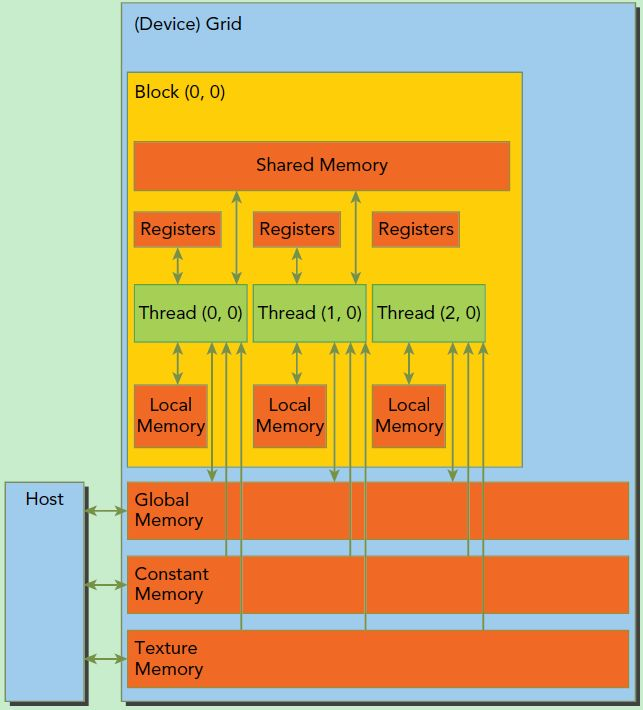

# GPU programming with CUDA
Reference: https://docs.nvidia.com/cuda/cuda-c-programming-guide/index.html#introduction

## GPU
 GPU is built around an array of **Streaming Multiprocessors(SMs)**. A multithreaded program is partitioned into blocks of threads that execute independently from each other, so that a GPU with more multiprocessors will automatically execute the program in less time than a GPU with fewer multiprocessors.

Number of SMs are depends on devices


Memory Model Diagram


## Programming Model
### Kernels
CUDA funtions. Kernel calls syntax:
```c++
// Kernel - copy
__global__ void func(float* a, float* b){
    int i = threadIdx.x;
    a[i] = b[i];
}

// host
int main(){
    int nBlock = 1;
    int nThreadPerBlock = 16
    func<<nBlock, nThreadPerBlock>>();
}

```

Dimension is defined by:
* block per grid
* thread per block  

You can use `int` or `dim3`

### Thread Hierarchy
Grid of Thread Blocks
- Grid (3 col * 2 row)
    - Block1 (0, 0)  -> (4 col * 3 row)
        - Thread 1 (0, 0)
        - Thread 2 (1, 0)
        - ...
        - ...
        -Thread 12 (3, 2)
    - Block2 (1, 0)
    - Block3 (2, 0)
    - Block4 (0, 1)
    - Block5 (1, 1)
    - Block6 (2, 1)

```c++
__global__ void funcAdd2D(float[][] a, float[][] b, float[][] c)
{
    int i = threadIdx.x;
    int j = threadIdx.y;
    c[i][j] = a[i][j] + b[i][j];
}

// sove 2d matrix use 1d vec r * c
__global__ void funcAdd1d(float* a, float* b, float* c)
{
    int r = threadIdx.x;
    int c = threadIdx.y;
    c[r][c] = a[r][c] + b[r][c];
}

int main()
{
    // 1. Kernel invocation with one block of N * N * 1 threads
    int numBlocks = 1;
    dim3 threadsPerBlock(N, N);
    funcAdd2d<<<numBlocks, threadsPerBlock>>>(A, B, C);

    // 2. use 1d vector to represent 2d matrix
    int nBlocks = 1;
    dim3 nThreads(r, c);
    funcAdd1d<<nBlocks, nThreads>>(a, b, c);

    // 3. set blocks number by calculation, e.g. img 512 * 512
// Kernel definition
const int N = 512;

__global__ void funcAdd1d(float* A, float* b, float* c)
{
    int x = blockIdx.x * blockDim.x + threadIdx.x;
    int y = blockIdx.y * blockDim.y + threadIdx.y;


    if (x < N && y < N)
        idx = x + y * N;
        C[idx] = A[idx] + B[idx];
}


    dim3 dimThread(16, 16);
    dim3 dimBlocks(N / threadsPerBlock.x, N / threadsPerBlock.y);
    MatAdd<<<dimBlocks, dimThread>>>(a, b, c);
}

```

### Fundmental Steps
1. Allocate **host** memory
    * initalzie
2. Allocate **device** memory
    * copy data from host to device
3. Call Kernels
4. Copy data back to host
5. Release device and host memory

### Check GPU hardware info before programming to use the best performance
```c++
int dev = 0;
    cudaDeviceProp devProp;
    CHECK(cudaGetDeviceProperties(&devProp, dev));
    std::cout << "GPU device Name" << dev << ": " << devProp.name << std::endl;
    std::cout << "SM Number：" << devProp.multiProcessorCount << std::endl;
    std::cout << "Share Memory Per Block：" << devProp.sharedMemPerBlock / 1024.0 << " KB" << std::endl;
    std::cout << "Max Thread per Block" << devProp.maxThreadsPerBlock << std::endl;
    std::cout << "Max Thead per EM" << devProp.maxThreadsPerMultiProcessor << std::endl;

```

## Unified Memory
```c++
cudaError_t cudaMallocManaged(void **devPtr, size_t size, unsigned int flag=0);

// Use cudaDeviceSynchronize() to access correct result in host.
cudaDeviceSynchronize();
```